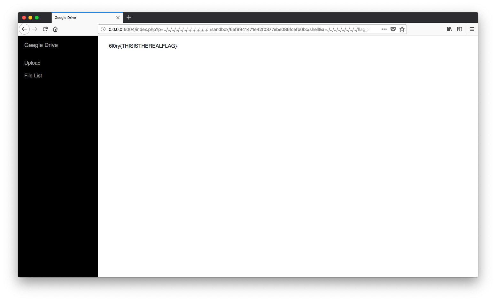

Web Solution
===
## poop
### chr()
[chr() manual](https://secure.php.net/manual/en/function.chr.php)
其中重點是 `Values outside the valid range (0..255) will be bitwise and'ed with 255`

### 傳入 array

php 可以利用 `$domain/?a[]=1&a[]=2` 傳入 array
`var_dump` 結果如下
```php
array(2) { [0]=> string(1) "1" [1]=> string(1) "2" }
```

### sort()

總結以上三點，可以得出解法：
將想要傳入的 payload 一字一字轉成數字且逐字比對，如
```
payload => 'l', 's', ' ', '-', 'a', 'l'
int_payload => 108, 115, 32, 45, 97, 108
```
在 payload[1] 和 payload[2] 處可以發現32明顯小於115，所以在32加上256就可以避免被 `sort()` 打亂payload

[Payload](./poop.py)

## cmdinj
### 利用反引號即可進行注入


最後即可讀取 flag


## Geegle Drive

這題放了三個假 flag
`/etc/passwd.php`, `/flag.php`, `flag.php`


### .git 洩漏
打 CTF 需要的不只是攻擊手法，有時更需要一些情報搜集的能力，我當初是想放 `robots.txt` 去提示，但是想到在 realcase 或是 CTF 比賽都沒有提示的，所以最後並沒有改。


### Code review
透過 Code review 可以知道

#### LFI
`index.php` 存在 LFI

https://github.com/6l0ryteam/6l0ry-wargame/blob/72b27ce5133bd065501a2570d09860807fabc87e/web/gd/www/index.php#L13

#### sandbox
`head.php` 得知 sandbox 位於 `/sandbox/md5("gd"+{ip})`

https://github.com/6l0ryteam/6l0ry-wargame/blob/72b27ce5133bd065501a2570d09860807fabc87e/web/gd/www/head.php#L3

#### Unrestricted upload
`uploadf.php` 並沒有檢查副檔名

https://github.com/6l0ryteam/6l0ry-wargame/blob/72b27ce5133bd065501a2570d09860807fabc87e/web/gd/www/uploadf.php#L11

綜合以上三點，可以上傳 shell


但是 flag 並不是 ascii，利用 `file` 指令探查 flag 格式


執行 flag


## LFI or RCE

Reference: https://kb.hitcon.org/post/165429468072/%E9%80%8F%E9%81%8E-lfi-%E5%BC%95%E5%85%A5-php-session-%E6%AA%94%E6%A1%88%E8%A7%B8%E7%99%BC-rce

接下來就直接放流程截圖


